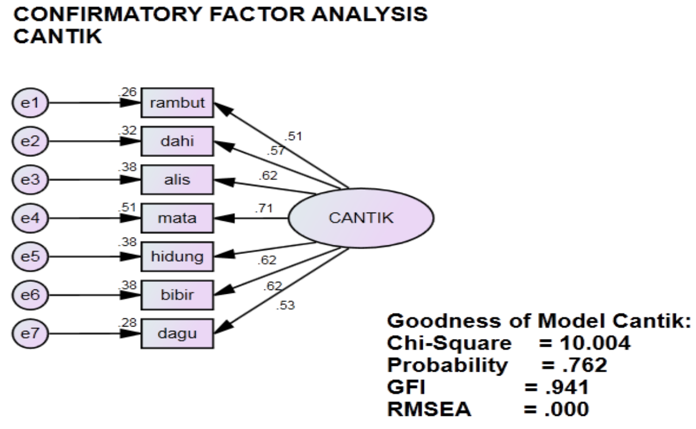

# Cantik dipengaruhi oleh variable apa ya?

Kali ini kita akan menggunakan  [confirmatory factor analysis](https://en.wikipedia.org/wiki/Confirmatory_factor_analysis)

Pemodelan **variabel latent cantik** dipengaruhi oleh **7 variabel** untuk itu digunakan operator **=~**

     modelcantik<-'cantik =~ A7 + A6 + A5 + A4 + A3 + A2 + A1'

Hasil running Rscript cantik.R

    lavaan (0.5-23.1097) converged normally after  26 iterations
    
      Number of observations                            49
    
      Estimator                                         ML
      Minimum Function Test Statistic               10.213
      Degrees of freedom                                14
      P-value (Chi-square)                           0.746
    
    Model test baseline model:
    
      Minimum Function Test Statistic               85.569
      Degrees of freedom                                21
      P-value                                        0.000
    
    User model versus baseline model:
    
      Comparative Fit Index (CFI)                    1.000
      Tucker-Lewis Index (TLI)                       1.088
    
    Loglikelihood and Information Criteria:
    
      Loglikelihood user model (H0)               -399.611
      Loglikelihood unrestricted model (H1)       -394.505
    
      Number of free parameters                         14
      Akaike (AIC)                                 827.223
      Bayesian (BIC)                               853.708
      Sample-size adjusted Bayesian (BIC)          809.776
    
    Root Mean Square Error of Approximation:
    
      RMSEA                                          0.000
      90 Percent Confidence Interval          0.000  0.100
      P-value RMSEA <= 0.05                          0.826
    
    Standardized Root Mean Square Residual:
    
      SRMR                                           0.056
    
    Parameter Estimates:
    
      Information                                 Expected
      Standard Errors                             Standard
    
    Latent Variables:
                       Estimate  Std.Err  z-value  P(>|z|)
      cantik =~                                           
        A7                1.000                           
        A6                0.992    0.336    2.957    0.003
        A5                1.046    0.353    2.961    0.003
        A4                1.123    0.353    3.179    0.001
        A3                0.992    0.336    2.956    0.003
        A2                0.952    0.338    2.818    0.005
        A1                0.770    0.292    2.638    0.008
    
    Variances:
                       Estimate  Std.Err  z-value  P(>|z|)
       .A7                0.724    0.161    4.484    0.000
       .A6                0.442    0.105    4.194    0.000
       .A5                0.488    0.116    4.188    0.000
       .A4                0.339    0.092    3.682    0.000
       .A3                0.442    0.105    4.195    0.000
       .A2                0.524    0.120    4.364    0.000
       .A1                0.458    0.102    4.513    0.000
        cantik            0.276    0.155    1.778    0.075
    
          lhs op    rhs est.std    se     z pvalue
    1  cantik =~     A7   0.525 0.122 4.299      0
    2  cantik =~     A6   0.617 0.109 5.663      0
    3  cantik =~     A5   0.618 0.109 5.689      0
    4  cantik =~     A4   0.712 0.094 7.536      0
    5  cantik =~     A3   0.617 0.109 5.658      0
    6  cantik =~     A2   0.569 0.116 4.898      0
    7  cantik =~     A1   0.513 0.124 4.142      0
    8      A7 ~~     A7   0.724 0.128 5.638      0
    9      A6 ~~     A6   0.619 0.134 4.607      0
    10     A5 ~~     A5   0.617 0.134 4.592      0
    11     A4 ~~     A4   0.493 0.134 3.669      0
    12     A3 ~~     A3   0.620 0.134 4.611      0
    13     A2 ~~     A2   0.677 0.132 5.123      0
    14     A1 ~~     A1   0.737 0.127 5.797      0
    15 cantik ~~ cantik   1.000 0.000    NA     NA
