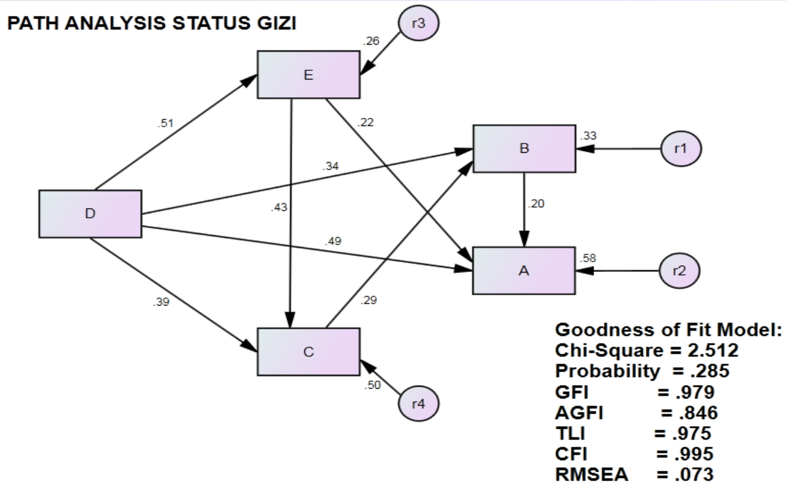

#Path Analysis Status Gizi

Path analysis menjelaskan hubungan langsung dan tidak langsung antar peubah baik itu independen maupun dependen variabel. 

Status gizi ini melihat hubungan antara 5 variabel, variabel A merupakan dependent, variabel D merupakan variabel independent

Pemodelan menggunakan tanda **~** yang berarti regresi

    modelgizi<-'A ~ B + D + E
    B ~ C + D
    C ~ D + E
    E ~ D'

Hasil menjalankan *Rscript gizi.R*

    lavaan (0.5-23.1097) converged normally after  42 iterations
    
      Number of observations                            49
    
      Estimator                                         ML
      Minimum Function Test Statistic                2.590
      Degrees of freedom                                 2
      P-value (Chi-square)                           0.274
    
    Model test baseline model:
    
      Minimum Function Test Statistic              113.729
      Degrees of freedom                                10
      P-value                                        0.000
    
    User model versus baseline model:
    
      Comparative Fit Index (CFI)                    0.994
      Tucker-Lewis Index (TLI)                       0.972
    
    Loglikelihood and Information Criteria:
    
      Loglikelihood user model (H0)               -156.205
      Loglikelihood unrestricted model (H1)       -154.910
    
      Number of free parameters                         16
      Akaike (AIC)                                 344.410
      Bayesian (BIC)                               374.679
      Sample-size adjusted Bayesian (BIC)          324.470
    
    Root Mean Square Error of Approximation:
    
      RMSEA                                          0.078
      90 Percent Confidence Interval          0.000  0.305
      P-value RMSEA <= 0.05                          0.316
    
    Standardized Root Mean Square Residual:
    
      SRMR                                           0.026
    
    Parameter Estimates:
    
      Information                                 Expected
      Standard Errors                             Standard
    
    Regressions:
                       Estimate  Std.Err  z-value  P(>|z|)
      A ~                                                 
        B                 0.170    0.094    1.809    0.070
        D                 0.392    0.094    4.154    0.000
        E                 0.163    0.080    2.054    0.040
      B ~                                                 
        C                 0.282    0.140    2.008    0.045
        D                 0.320    0.136    2.348    0.019
      C ~                                                 
        D                 0.374    0.114    3.292    0.001
        E                 0.386    0.105    3.673    0.000
      E ~                                                 
        D                 0.551    0.133    4.138    0.000
    
    Intercepts:
                       Estimate  Std.Err  z-value  P(>|z|)
       .A                 0.949    0.370    2.567    0.010
       .B                 1.510    0.492    3.068    0.002
       .C                 0.880    0.440    1.999    0.046
       .E                 1.829    0.539    3.395    0.001
    
    Variances:
                       Estimate  Std.Err  z-value  P(>|z|)
       .A                 0.097    0.020    4.950    0.000
       .B                 0.211    0.043    4.950    0.000
       .C                 0.171    0.035    4.950    0.000
       .E                 0.317    0.064    4.950    0.000
    
       lhs op rhs est.std    se     z pvalue
    1    A  ~   B   0.198 0.109 1.819  0.069
    2    A  ~   D   0.494 0.109 4.548  0.000
    3    A  ~   E   0.223 0.108 2.069  0.039
    4    B  ~   C   0.295 0.143 2.060  0.039
    5    B  ~   D   0.345 0.139 2.473  0.013
    6    C  ~   D   0.385 0.110 3.518  0.000
    7    C  ~   E   0.430 0.111 3.890  0.000
    8    E  ~   D   0.509 0.099 5.152  0.000
    9    A ~~   A   0.421 0.081 5.214  0.000
    10   B ~~   B   0.671 0.104 6.484  0.000
    11   C ~~   C   0.498 0.094 5.303  0.000
    12   E ~~   E   0.741 0.101 7.372  0.000
    13   D ~~   D   1.000 0.000    NA     NA
    14   A ~1       1.980 0.911 2.174  0.030
    15   B ~1       2.696 1.075 2.508  0.012
    16   C ~1       1.500 0.861 1.742  0.081
    17   E ~1       2.796 1.019 2.745  0.006
    18   D ~1       6.623 0.000    NA     NA

