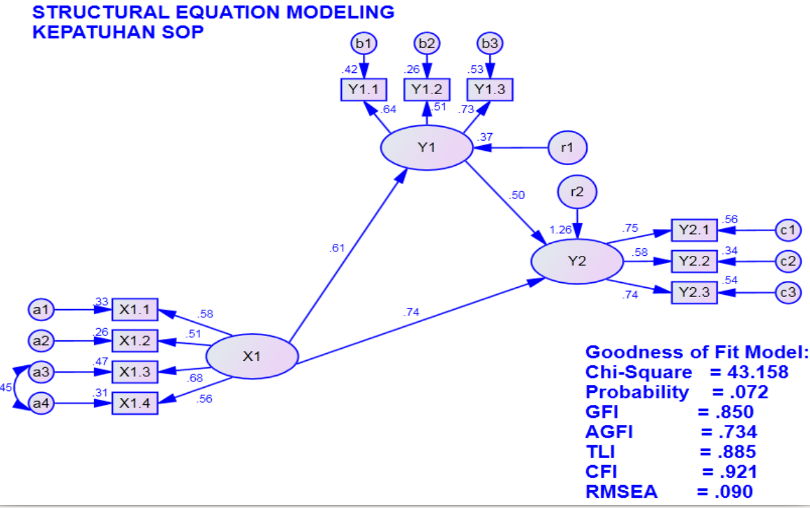

# SEM Kepatuhan SOP

Pemodelan **variabel latent X1, Y1 dan Y2** dipengaruhi oleh **10 variabel** untuk itu digunakan operator **=~** , **~** dan **~~**. 

    modelsop<-' # measurement model
    X1 =~ X1.4 + X1.3 + X1.2 + X1.1
    Y1 =~ Y1.1 + Y1.2 + Y1.3
    Y2 =~ Y2.1 + Y2.2 + Y2.3
    # regressions
    Y2 ~ X1 + Y1
    Y1 ~ X1'
    # residual correlations
    X1.3 ~~ X1.4'

Hasil running Rscript sop-modif.R

    lavaan (0.5-23.1097) converged normally after  41 iterations
    
      Number of observations                            49
    
      Estimator                                         ML
      Minimum Function Test Statistic               44.147
      Degrees of freedom                                31
      P-value (Chi-square)                           0.059
    
    Model test baseline model:
    
      Minimum Function Test Statistic              202.502
      Degrees of freedom                                45
      P-value                                        0.000
    
    User model versus baseline model:
    
      Comparative Fit Index (CFI)                    0.917
      Tucker-Lewis Index (TLI)                       0.879
    
    Loglikelihood and Information Criteria:
    
      Loglikelihood user model (H0)               -473.582
      Loglikelihood unrestricted model (H1)       -451.509
    
      Number of free parameters                         34
      Akaike (AIC)                                1015.164
      Bayesian (BIC)                              1079.486
      Sample-size adjusted Bayesian (BIC)          972.792
    
    Root Mean Square Error of Approximation:
    
      RMSEA                                          0.093
      90 Percent Confidence Interval          0.000  0.151
      P-value RMSEA <= 0.05                          0.144
    
    Standardized Root Mean Square Residual:
    
      SRMR                                           0.078
    
    Parameter Estimates:
    
      Information                                 Expected
      Standard Errors                             Standard
    
    Latent Variables:
                       Estimate  Std.Err  z-value  P(>|z|)
      X1 =~                                               
        X1.4              1.000                           
        X1.3              1.450    0.486    2.981    0.003
        X1.2              1.026    0.355    2.890    0.004
        X1.1              1.082    0.341    3.172    0.002
      Y1 =~                                               
        Y1.1              1.000                           
        Y1.2              0.828    0.273    3.031    0.002
        Y1.3              1.100    0.275    3.997    0.000
      Y2 =~                                               
        Y2.1              1.000                           
        Y2.2              0.902    0.211    4.275    0.000
        Y2.3              1.200    0.216    5.566    0.000
    
    Regressions:
                       Estimate  Std.Err  z-value  P(>|z|)
      Y2 ~                                                
        X1                0.601    0.205    2.935    0.003
        Y1                0.334    0.130    2.559    0.011
      Y1 ~                                                
        X1                0.747    0.306    2.442    0.015
    
    Covariances:
                       Estimate  Std.Err  z-value  P(>|z|)
     .X1.4 ~~                                             
       .X1.3             -0.203    0.080   -2.528    0.011
    
    Intercepts:
                       Estimate  Std.Err  z-value  P(>|z|)
       .X1.4              4.020    0.114   35.394    0.000
       .X1.3              3.918    0.135   29.053    0.000
       .X1.2              3.918    0.129   30.483    0.000
       .X1.1              4.143    0.119   34.814    0.000
       .Y1.1              3.980    0.121   32.971    0.000
       .Y1.2              4.000    0.126   31.795    0.000
       .Y1.3              4.122    0.118   35.023    0.000
       .Y2.1              3.838    0.069   55.833    0.000
       .Y2.2              3.898    0.080   48.702    0.000
       .Y2.3              3.934    0.084   46.933    0.000
        X1                0.000                           
       .Y1                0.000                           
       .Y2                0.000                           
    
    Variances:
                       Estimate  Std.Err  z-value  P(>|z|)
       .X1.4              0.435    0.096    4.527    0.000
       .X1.3              0.476    0.117    4.083    0.000
       .X1.2              0.602    0.127    4.739    0.000
       .X1.1              0.463    0.100    4.634    0.000
       .Y1.1              0.417    0.101    4.124    0.000
       .Y1.2              0.572    0.125    4.563    0.000
       .Y1.3              0.320    0.091    3.533    0.000
       .Y2.1              0.101    0.023    4.418    0.000
       .Y2.2              0.208    0.043    4.880    0.000
       .Y2.3              0.157    0.035    4.483    0.000
        X1                0.197    0.101    1.963    0.050
       .Y1                0.186    0.096    1.947    0.052
       .Y2               -0.033    0.015   -2.249    0.024
    
        lhs op  rhs est.std    se      z pvalue
    1    X1 =~ X1.4   0.559 0.113  4.962  0.000
    2    X1 =~ X1.3   0.682 0.094  7.289  0.000
    3    X1 =~ X1.2   0.506 0.115  4.394  0.000
    4    X1 =~ X1.1   0.577 0.105  5.499  0.000
    5    Y1 =~ Y1.1   0.644 0.103  6.237  0.000
    6    Y1 =~ Y1.2   0.512 0.122  4.195  0.000
    7    Y1 =~ Y1.3   0.727 0.093  7.804  0.000
    8    Y2 =~ Y2.1   0.749 0.069 10.801  0.000
    9    Y2 =~ Y2.2   0.581 0.097  6.004  0.000
    10   Y2 =~ Y2.3   0.737 0.071 10.322  0.000
    11   Y2  ~   X1   0.741 0.152  4.877  0.000
    12   Y2  ~   Y1   0.504 0.159  3.172  0.002
    13   Y1  ~   X1   0.610 0.153  3.997  0.000
    14 X1.4 ~~ X1.3  -0.446 0.164 -2.714  0.007
    15 X1.4 ~~ X1.4   0.688 0.126  5.467  0.000
    16 X1.3 ~~ X1.3   0.534 0.128  4.182  0.000
    17 X1.2 ~~ X1.2   0.744 0.117  6.369  0.000
    18 X1.1 ~~ X1.1   0.667 0.121  5.511  0.000
    19 Y1.1 ~~ Y1.1   0.585 0.133  4.391  0.000
    20 Y1.2 ~~ Y1.2   0.738 0.125  5.915  0.000
    21 Y1.3 ~~ Y1.3   0.472 0.135  3.483  0.000
    22 Y2.1 ~~ Y2.1   0.438 0.104  4.216  0.000
    23 Y2.2 ~~ Y2.2   0.663 0.112  5.903  0.000
    24 Y2.3 ~~ Y2.3   0.456 0.105  4.330  0.000
    25   X1 ~~   X1   1.000 0.000     NA     NA
    26   Y1 ~~   Y1   0.628 0.186  3.380  0.001
    27   Y2 ~~   Y2  -0.258 0.131 -1.960  0.050
    28 X1.4 ~1        5.056 0.530  9.534  0.000
    29 X1.3 ~1        4.150 0.443  9.370  0.000
    30 X1.2 ~1        4.355 0.463  9.415  0.000
    31 X1.1 ~1        4.973 0.522  9.522  0.000
    32 Y1.1 ~1        4.710 0.497  9.481  0.000
    33 Y1.2 ~1        4.542 0.481  9.452  0.000
    34 Y1.3 ~1        5.003 0.525  9.526  0.000
    35 Y2.1 ~1        7.976 0.818  9.747  0.000
    36 Y2.2 ~1        6.957 0.717  9.701  0.000
    37 Y2.3 ~1        6.705 0.692  9.686  0.000
    38   X1 ~1        0.000 0.000     NA     NA
    39   Y1 ~1        0.000 0.000     NA     NA
    40   Y2 ~1        0.000 0.000     NA     NA

